# 排序方法总结

## 一、引子

排序是在求职或者实际工作中必定会遇到的问题，熟练掌握排序算法对一个程序开发人员来说是一项基本的要求，因此有必要对排序的方法进行总结。

主要的参考资料如下：

- [http://www.cnblogs.com/leeplogs/p/5863846.html](http://www.cnblogs.com/leeplogs/p/5863846.html)
- [http://blog.csdn.net/u013989576/article/details/61414224?locationNum=2&fps=1](http://blog.csdn.net/u013989576/article/details/61414224?locationNum=2&fps=1)
- [https://github.com/Derekwq/SortDemo](https://github.com/Derekwq/SortDemo)

## 二、排序方法的分类

排序是计算机内经常进行的一种操作，其目的是将一组“无序”的记录序列调整为“有序”的记录序列。排序大致可以分为两类，即**内排序**与**外排序**。若整个排序过程不需要访问外存便能完成，则称此类排序问题为内部排序。反之，若参加排序的记录数量很大，整个序列的排序过程不可能在内存中完成，则称此类排序问题为外部排序。内部排序的过程是一个逐步扩大记录的有序序列长度的过程。

要总结排序方法，首先需要了解**稳定**的概念。假定在待排序的记录序列中，存在多个具有相同的关键字的记录，若经过排序，这些记录的相对次序保持不变，即在原序列中，ri=rj，且ri在rj之前，而在排序后的序列中，ri仍在rj之前，则称这种排序算法是稳定的；否则称为不稳定的。

内排序可以分为以下几类：

- 插入排序：直接插入排序、Shell排序
- 选择排序：直接选择排序、堆排序
- 交换排序：冒泡排序、快速排序

外排序可以分为以下几类：

- 归并排序
- 基数排序

各种排序算法的性能分析如下：

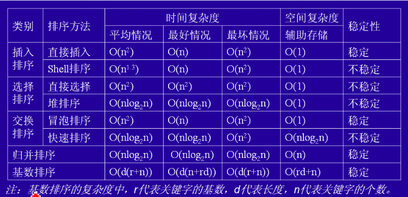

## 三、插入排序

### 3.1 直接插入排序（Straight Insertion Sort）

基本思想：将一个记录插入到已排好序的有序表中，从而得到一个记录数加一的新的有序表。

直接插入排序示例：

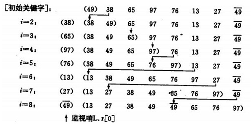

如果碰到一个和插入元素相等的元素，那么将插入元素放在相等元素的后面，相等元素的插入顺序没有改变，所以直接插入排序是稳定的。

代码实现：

```
public void straightInsertSort(int[] array) {
    // 直接插入排序
    for (int i = 1; i < array.length; i++) {
        // 发生逆序，往前插入
        if (array[i] < array[i - 1]) {
            int temp = array[i];

            int j;
            for (j = i - 1; j >= 0 && array[j] > temp; j--)
                array[j + 1] = array[j]; // array[i]之前的元素大于待插入元素，后移一位
            array[j + 1] = temp;
        }
    }
}
```

### 3.2 二分插入排序（Binary Insertion Sort）

基本思想：二分插入排序的思想和直接插入排序一样，只是找到合适的插入位置的方式不同，这里是按二分法找到合适的位置，可以减少比较的次数。

二分插入排序示例：

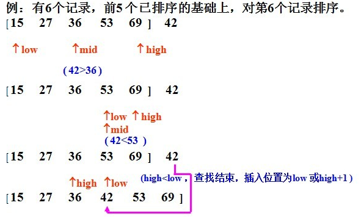

二分插入排序也是稳定的。其平均时间为O(n^2)。

代码实现：

```
public void binaryInsertSort(int[] array) {
    // 二分插入排序
    for (int i = 1; i < array.length; i++) {
        // 发生逆序，往前插入
        if (array[i] < array[i - 1]) {
            int temp = array[i];

            // 用二分查找法查找插入位置
            int low = 0, high = i - 1, mid;
            while (low <= high) {
                mid = low + (high - low) / 2;

                if (temp < array[mid])
                    high = mid - 1;
                else
                    low = mid + 1;
            }

            for (int j = i; j > low; j--)
                array[j] = array[j - 1];

            array[low] = temp;
        }
    }
}
```

### 3.3 希尔排序（Shell's Sort）

希尔排序是1959年由D.L.Shell提出来的，相对于直接插入排序有较大的改进。希尔排序又叫做**缩小增量排序**。

基本思想：先将整个待排序序列分割成若干个子序列，对这些子序列分别进行插入排序，待整个序列中的记录“基本有序”时，再对整体记录进行一次插入排序。需要注意的是，子序列的构成不是简单的逐段分割，而是将相隔某个增量的记录组成一个子序列。

具体为：

- 1）先是取一个合适的gap<n作为间隔，将全部元素分为gap个子序列，所有距离为gap的元素放入同一个子序列，再对每个子序列进行直接插入排序；
- 2）缩小间隔gap，例如去gap=ceil(gap/2)，重复上述子序列划分和排序；
- 3）直到，最后gap=1时，将所有元素放在同一个序列中进行插入排序为止。

希尔排序示例：

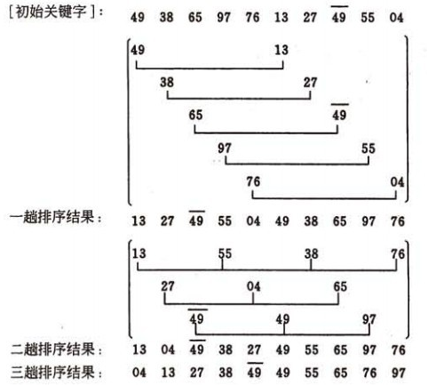

虽然一次插入排序是稳定的，但在不同的插入排序过程中，相同的元素可能在各自的插入排序中移动，最后其稳定性就会被打乱，所以希尔排序是不稳定的。

代码实现：

```
public void shellSort(int[] array) {
    int len = array.length;

	 // 每次选择一个gap，对相隔gap的数进行插入排序
    for (int gap = len / 2; gap > 0; gap /= 2) {
        for (int i = 0; i < len; i += gap) {
            int temp = array[i];

            int j;
            for (j = i; j >= gap && temp < array[j - gap]; j -= gap)
                array[j] = array[j - gap];
            array[j] = temp;
        }
    }
}
```

## 四、交换排序

### 4.1 冒泡排序（Bubble Sort）

基本思想：首先将第一个记录的关键字与第二个记录的关键字进行比较，如果为逆序，则将两个记录交换，然后比较第二个记录与第三个记录的关键字。以此类推，直至第n-1个记录和第n个记录的关键字进行比较为止。上述过程为第一趟冒泡排序，其结果是使得关键字最大的记录被安置到最后一个记录的位置上，然后进行第二趟冒泡排序，对前n-1个记录进行同样操作，其结果是使得关键字次大的记录被安置到第n-1个位置上。一般地，第i趟冒泡排序是从a[0]到a[n-i]依次比较相邻两个记录的关键字，并在逆序时交换记录，其结果是这n-i+1个记录中关键字最大的记录被交换到第n-i个位置上。

冒泡排序示例：

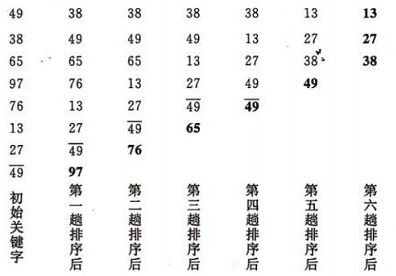

冒泡排序是一种稳定的排序方法。

代码实现：

```
public void bubbleSort(int[] array) {
    // 冒泡排序
    for (int i = 0; i < array.length; i++) {
        for (int j = 0; j < array.length - i - 1; j++) {
            if (array[j] > array[j + 1]) {
                int temp = array[j];
                array[j] = array[j + 1];
                array[j + 1] = temp;
            }
        }
    }
}
```

### 4.2 快速排序（Quick Sort）

基本思想：

- 1）选取一个基准元素，通常选择第一个元素或者最后一个元素；
- 2）通过一趟排序将待排序的记录分割成独立的两部分。其中，一部分记录的元素值比基准元素小，另一部分记录的元素值比基准值大；
- 3）此时基准元素在其排好序后的正确位置；
- 4）分别对这两部分记录用同样的方法继续进行排序，直到整个序列有序。

快速排序示例：

- 1）一趟排序的过程：

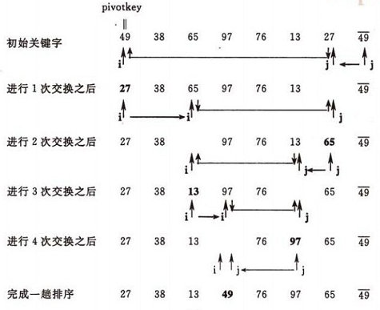

- 2）排序的全过程：

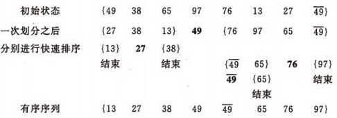

快速排序是不稳定的排序。

```
public int partition(int[] array, int low, int high) {
    int pivotKey = array[low]; // 基准元素
    while (low < high) { // 从表的两端交替的向中间扫描
        while (low < high && array[high] >= pivotKey) // 从high所指的位置向前搜索，至多到low+1位置。将比基准元素小的交换到低端
            high--;
        array[low] = array[high];

        while (low < high && array[low] <= pivotKey)
            low++;
        array[high] = array[low];
    }
    array[low] = pivotKey;

    return low;
}

public void quickSort(int[] array, int low, int high) {
    if (low >= high)
        return;

    int pivotLoc = partition(array, low, high); // 将表一分为二
    quickSort(array, low, pivotLoc - 1); // 对低端子表递归排序
    quickSort(array, pivotLoc + 1, high); // 对高端子表递归排序
}
```

## 五、选择排序

### 5.1 直接选择排序（Simple Selection Sort）

基本思想：在要排序的一组数中，选出最小（最大）的数与第一个位置的数交换，然后在剩下的数中，选出最小（最大）的数与第二个位置的数交换。以此类推，直到第n-1个位置（第倒数第二个数）和第n个元素（最后一个数）比较为止。

直接选择排序示例：

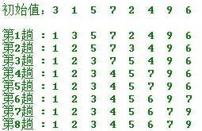

直接选择排序是不稳定的排序。

代码实现：

```
public void selectSort(int[] array) {
    for (int i = 0; i < array.length; i++) {
        int minVal = array[i];
        int minIndex = i;
        for (int j = i + 1; j < array.length; j++) {
            if (array[j] < minVal) {
                minVal = array[j];
                minIndex = j;
            }
        }

        array[minIndex] = array[i];
        array[i] = minVal;
    }
}
```

### 5.2 堆排序（Heap Sort）

要掌握堆排序，首先要了解**堆**的概念。

堆的定义：具有n个元素的序列k1，k2，k3，...，kn，当且仅当满足如下条件时，称之为堆。

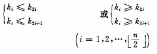

若将此序列所存储的向量R[1..n]看做是一棵完全二叉树的存储结构，则堆实质上是满足如下性质的完全二叉树：**树中任一非叶子结点的关键字均不大于（或不小于）其左右孩子（若存在）结点的关键字**。

大根堆和小根堆：根结点（亦称为堆顶）的关键字是堆里所中最小者的堆称为小根堆，又称最小堆。根结点（亦称为堆顶）的关键字是堆里所有结点关键字中最大者，称为大根堆，又称最大堆。注意：一、堆中任一子树亦是堆；二、以上讨论的堆实际上是二叉堆（Binary Heap），类似地可定义k叉堆。

大根堆和小根堆的示例如下：

(a) 大根堆序列：（96，83，27，38，11，09)

(b) 小根堆序列：（12，36，24，85，47，30，53，91）

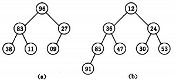

基本思想：初始时把要排序的n个数的序列看做是一棵顺序存储的二叉树，调整它们的存储顺序，使之成为一个堆，将栈顶元素输出，得到n个元素中最小（最大）的元素；之后对剩余的n-1个元素重新调整使之成为堆，输出栈顶元素，得到n个元素中次小（次大）的元素；以此类推，直到得到只有两个结点的堆，并对它们做交换，最后得到有n个结点的有序序列。称这个过程为堆排序。

调整小根堆的方法：

- 1）设有m个元素的堆，输出堆顶元素后，剩下m-1个元素。将堆底元素送入堆顶（最后一个元素与堆顶进行交换），堆被破坏；
- 2）将根结点与左、右子树中较小元素的进行交换；
- 3）若与左子树交换：如果左子树堆被破坏，即左子树的根结点不满足堆的性质，则重复方法（2）；
- 4）若与右子树交换，如果右子树堆被破坏，即右子树的根结点不满足堆的性质，则重复方法（2）；
- 5）继续对不满足堆性质的子树进行上述交换操作，直到叶子结点，堆被建成。

其示例如下：

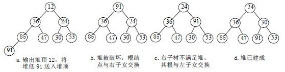

对n个元素初始建堆的步骤如下：

- 1）n个结点的完全二叉树，则最后一个结点是第n/2个结点的子树；
- 2）筛选从第n/2个结点为根的子树开始，使该子树成为堆;
- 3）之后向前依次对以各结点为根的子树进行筛选，使之成为堆，直到根结点。

初始序列建堆的序列如下：无序序列（49，38，65，97，76，13，27，49）

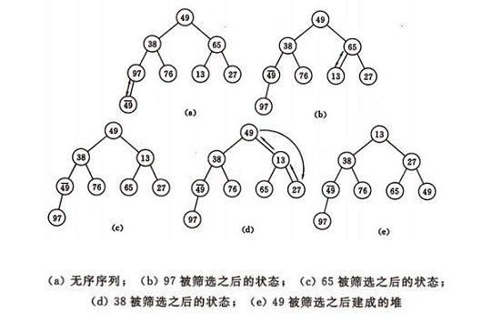

堆排序是一种不稳定的排序方法。

代码实现：

```
public void swap(int[] array, int i, int j) {
    int temp = array[i];
    array[i] = array[j];
    array[j] = temp;
}

public static void buildMaxHeap(int[] array, int end) {
    for (int i = (end - 1) / 2; i >= 0; i--) {
        int dad = i;
        int son = dad * 2 + 1;

        if ((son + 1) <= end && array[son] < array[son + 1])
            son++;

        if (array[dad] < array[son])
            swap(array, dad, son);
    }
}

public static void heapSort(int[] array) {
    buildMaxHeap(array, array.length - 1);

    for (int i = array.length - 1; i >= 0; i--) {
        swap(array, 0, i);
        buildMaxHeap(array, i - 1);
    }

    swap(array, 0, 1);
}
```

## 六、其他排序

### 6.1 归并排序（Merge Sort）

基本思想：归并排序是将两个或两个以上的有序表合并成一个新的有序表。即把待排序序列分为若干个子序列，每个子序列是有序的，然后再把有序子序列合并为整体有序序列。

归并排序示例：

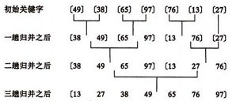

归并排序是稳定的排序方法。

代码实现：

```
public void merge(int[] array, int left, int middle, int right) {
    int[] tmpArray = new int[array.length];
    int mid = middle + 1; // 右边的起始位置
    int tmp = left;
    int third = left;

    while (left <= middle && mid <= right) {
        // 从两数组中选取较小的数放入数组
        if (array[left] < array[mid])
            tmpArray[third++] = array[left];
        else
            tmpArray[third++] = array[mid++];
    }

    // 将剩余部分放入中间数组
    while (left <= middle)
        tmpArray[third++] = array[left++];
    while (mid <= right)
        tmpArray[third++] = array[mid++];

    // 将中间数组复制回原数组
    while (tmp <= right)
        array[tmp] = tmpArray[tmp++];
}

public void mergeSort(int[] array, int left, int right) {
    if (left < right) {
        int middle = (left + right) / 2;
        // 对左边进行递归
        mergeSort(array, left, middle);
        // 对右边进行递归
        mergeSort(array, middle + 1, right);
        // 合并
        merge(array, left, middle, right);
    }
}
```

### 6.2 基数排序（Radix Sort）

基本思想：基数排序是一种借助多关键字排序的思想对单逻辑关键字进行排序的方法。实现多关键字排序的方法有：最高位优先、最低位优先。

示例：

假设待排序数组为：73  22  93  43  55  14  28  65  39  81

- 1）首先根据个位的数值，在遍历数据时，将它们各自分配到编号0至9的桶中（个位数值与桶号一一对应），分配结果如下：

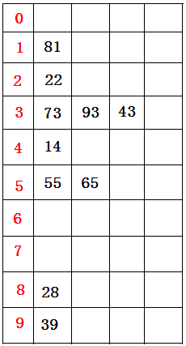

- 2）接下来将所有桶中数据按照桶号由小到大（桶中由顶至底）依次重新收集串起来，得到如下仍然无序的数据序列：81  22  73  93  43  14  55  65  28  39

- 3）再进行一次分配，这次根据十位数值来分配（原理同上），分配结果如下图所示：

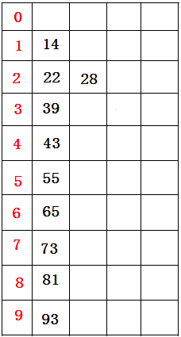

- 4）接下来再将所有桶中所盛的数据（原理同上）依次重新收集串接起来，得到如下的数据序列：14  22  28  39  43  55  65  73  81  93

基数排序是稳定的排序算法。

*这里不再详述。*

### 6.3 桶排序（Bucket Sort）

基本思想：

桶排序的原理是将数列分到有限数量的桶子里，对每个桶子分别排序。

当要被排序的阵列内的数值是均匀分配时候，桶排序使用线性时间(Θ(n))。但桶排序并不是比较排序，它不受到 O(nlogn)下限的影响。

例如：要对大小为[1..1000]范围内的n个整数A[1..n]排序，可以把桶设为大小为10的范围，具体而言，设集合B[1]存储[1..10]的整数，集合B[2]存储(10..20]的整数，...，集合B[i]存储((i-1)*10, i*10]的整数，i = 1,2,..100。总共有100个桶。然后对A[1..n]从头到尾扫描一遍，把每个A[i]放入对应的桶B[j]中。 然后再对这100个桶中每个桶里的数字排序，这时可用冒泡、选择、乃至快排，一般来说任何排序法都可以。最后依次输出每个桶里面的数字，且每个桶中的数字从小到大输出，这样就得到所有数字排好序的一个序列了。

假设有n个数字，有m个桶，如果数字是平均分布的，则每个桶里面平均有n/m个数字。如果对每个桶中的数字采用快速排序，那么整个算法的复杂度是O(n+m*n/m*log(n/m))=O(n+nlogn-nlogm)。从上式看出，当m接近n的时候，桶排序复杂度接近O(n)。该复杂度的计算是基于输入的n个数字是平均分布这个假设的。然而，这个假设是很强的，实际应用中效果并没有这么好。如果所有的数字都落在同一个桶中，那就退化成一般的排序了。

桶排序是稳定的。

*这里不再详述。*